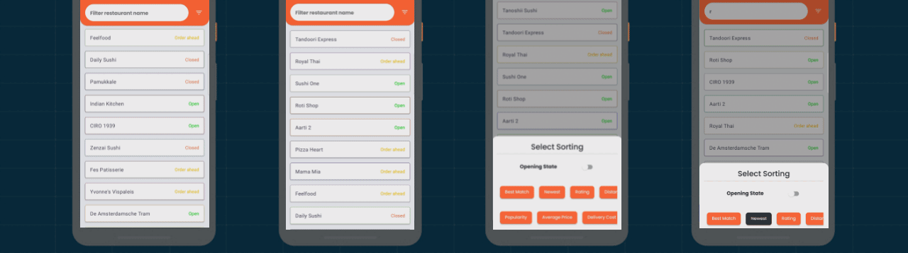
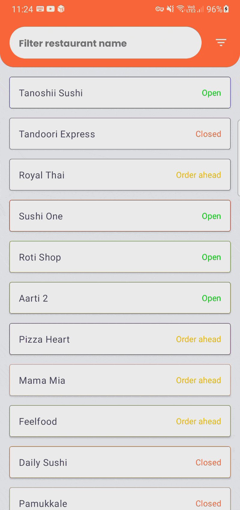
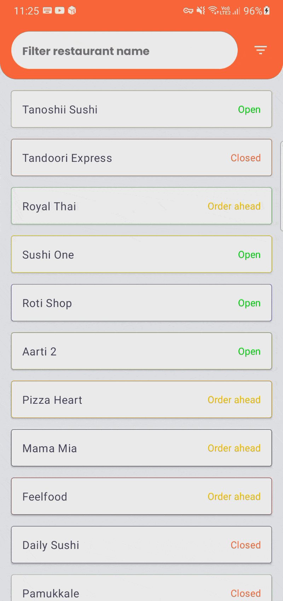

# Restaurants - Jetpack Compose

An example concepts of MVVM and Kotlin. Display, Filter & Sort the given restaurants from assets with Jetpack Compose and AAC.

## The Goal
Visualize a restaurant list with filtering based on name and sorting value to sort the list.

### Features 🔥
- Demo is memory leak-free (leakCanary).
- UseCase / Repository / DataSource logics are best practises from clean architecture.
- Long-running operations(sorting in extensive lists) are calculated in IO Dispatcher.
- Furthermore, good applications deserves good logging mechanism,so Timber added.
- Android Architecture Components
- Code quality, readability and consistent code style (Detekt).
- Multi-module architecture
- Jetpack Compose with Navigation
- Kotlin Flow
- Multiple Data Sources
- Unit test (JUnit)
- Instrumentation Test(Compose)
- Both vertical / portrait support
- Context-configuration changes retain outgoing requests.

      

